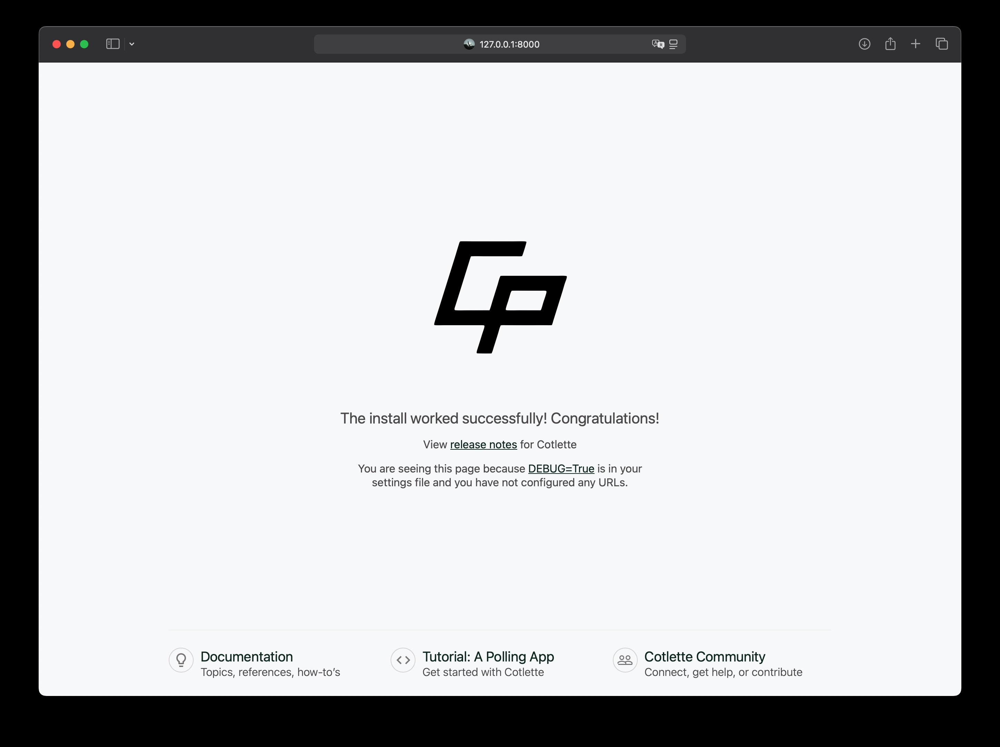

# Cotlette 🚀

**Cotlette** is a modern, Django-inspired web framework built on top of **FastAPI**. It combines the best of both worlds: the speed and async power of FastAPI with the convenience of Django-like project structure, ORM, templates, and management commands.

---

## Key Features

- **FastAPI Under the Hood**: High-performance async web framework
- **Django-like Project Structure**: Familiar and easy to organize
- **Custom ORM**: Simple, Pythonic, and extensible
- **Jinja2 Templates**: Powerful and flexible HTML rendering
- **Admin Panel**: Built-in, customizable (inspired by Django admin)
- **Management Commands**: CLI for project/app creation, server, shell, and more
- **Asynchronous Support**: Full async views and endpoints
- **Extensible**: Add your own apps, middleware, commands, and more

---

## Quick Start

### 1. Install Cotlette
```bash
pip install cotlette
```

### 2. Create a New Project
```bash
cotlette startproject myproject
cd myproject
```

### 3. Run the Development Server
```bash
cotlette runserver
```

Open your browser at [http://127.0.0.1:8000](http://127.0.0.1:8000/)

---

## Screenshots

**Home Page:**


**Login Page:**


**Admin Panel:**


---

## Example: Defining a Model
```python
from cotlette.db import Model, fields

class Article(Model):
    title = fields.CharField(max_length=200)
    content = fields.TextField()
    published_at = fields.DateTimeField(auto_now_add=True)
```

## Example: Creating a View
```python
from fastapi import APIRouter
from cotlette.shortcuts import render_template
from .models import Article

router = APIRouter()

@router.get("/")
async def home():
    articles = await Article.objects.all()
    return render_template("index.html", {"articles": articles})
```

---

## Management Commands

- `cotlette startproject <project_name>` — Create a new project
- `cotlette startapp <app_name>` — Create a new app
- `cotlette runserver` — Start the development server
- `cotlette shell` — Interactive Python shell

---

## Documentation

- [Technical Documentation](.docs/index.md)
- [ORM Reference](.docs/orm.md)
- [Template Reference](.docs/templates.md)
- [Command Reference](.docs/commands.md)
- [Middleware Reference](.docs/middleware.md)
- [Extending Cotlette](.docs/extending.md)
- [FAQ](.docs/faq.md)

---

## License

MIT License. See [LICENSE](LICENSE) for details.

---

## Contributing

Pull requests and issues are welcome! See [GitHub](https://github.com/ForceFledgling/cotlette).
